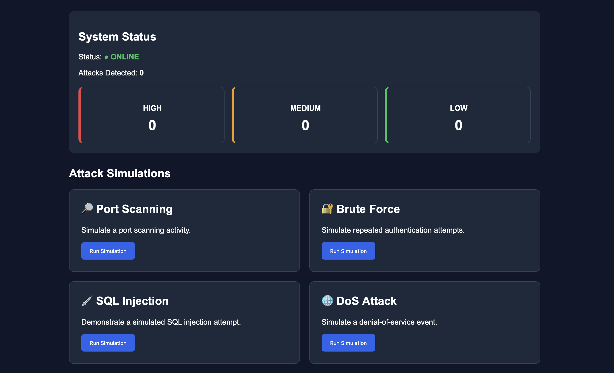
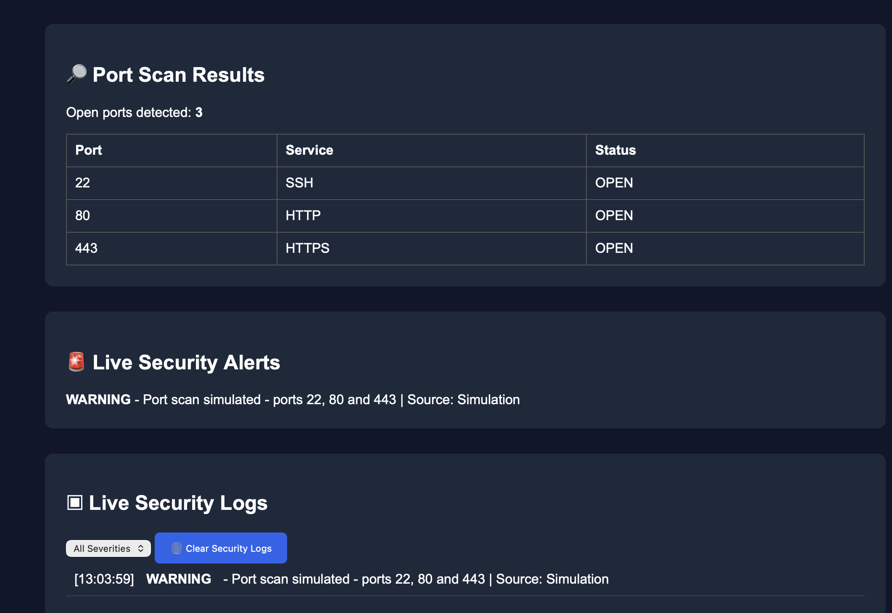

# Sentinel Security Platform

A web-based cybersecurity attack simulation and monitoring platform built with Python Flask, HTML, CSS and JavaScript.

## 📸 Screenshots

### Main Dashboard


### Security Monitoring


## 🛡️ Overview

Sentinel Security Platform is an educational cybersecurity project designed to simulate common cyber attacks and display security events through a real-time monitoring dashboard.

The platform allows users to safely demonstrate simulated attacks and observe how security events can be detected, logged and classified by severity.

## 🚨 Features

- Port Scanning Simulation
- Brute Force Simulation
- SQL Injection Simulation
- DoS Attack Simulation
- Real-time Security Logs
- Live Security Alerts
- Attack Statistics
- High, Medium and Low Severity Classification
- Security Log Filtering
- Clear Security Logs
- Port Scan Results

## 💻 Technologies

- Python
- Flask
- HTML5
- CSS3
- JavaScript
- Git & GitHub

## 📁 Project Structure

```text
sentinel-security-platform/
│
├── attacks/
├── logs/
├── templates/
│   └── index.html
├── venv/
├── app.py
├── .gitignore
├── LICENSE
└── README.md
## ⚙️ Installation and Setup

### 1. Clone the repository

```bash
git clone https://github.com/a2844r/cybersecurity-attack-platform.git
cd cybersecurity-attack-platform